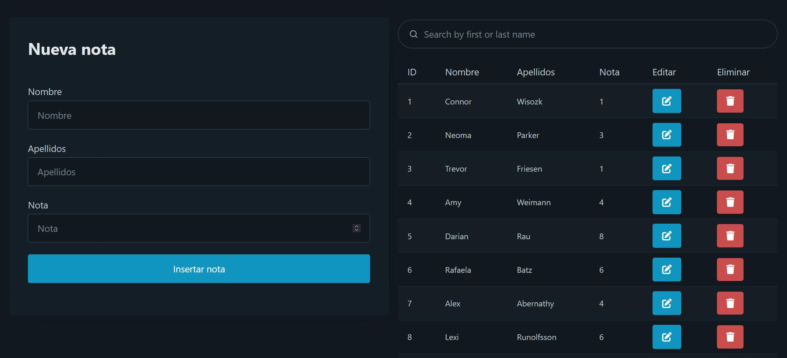
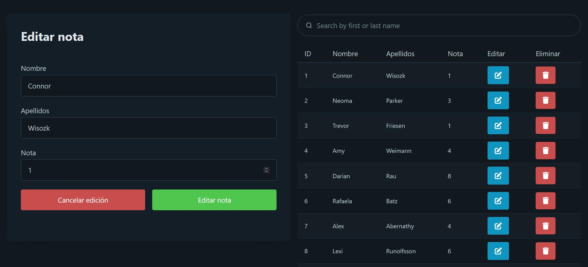
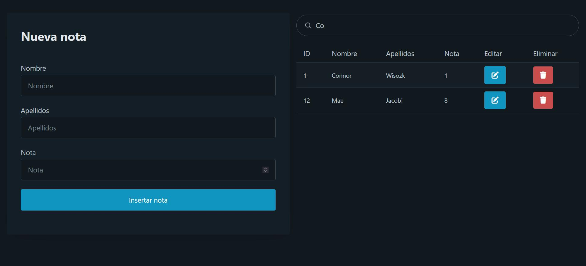

# Springboot + MariaDB + PicoCSS CRUD
CRUD created as an introductory practice to creating APIs with Springboot and MariaDB

## Main view

## Edit 
The panel at the right changes to the edit panel.

## Dynamic search 
Each time you type in the search bar, a request is generated to search the database by first and last name.

